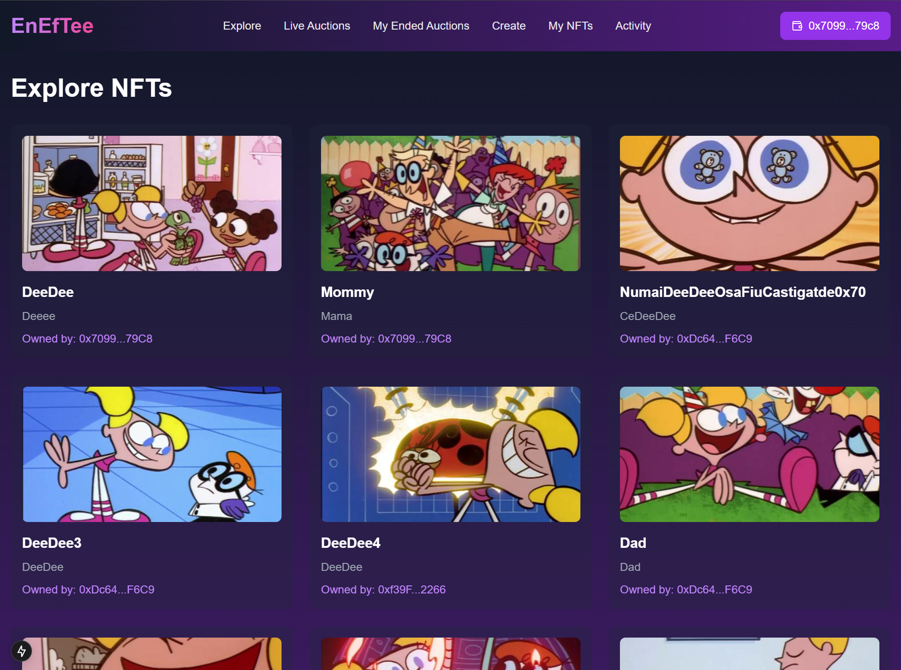
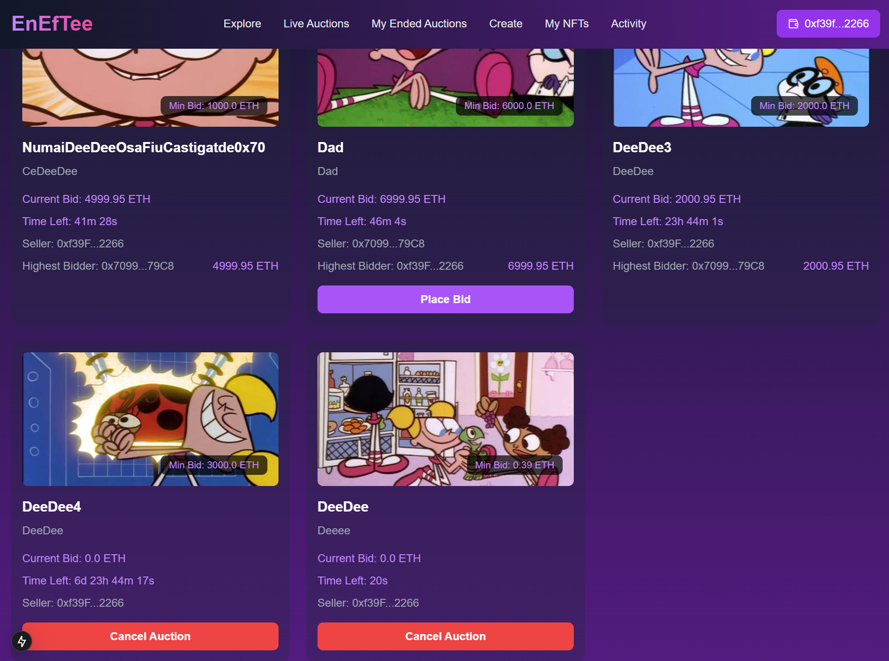
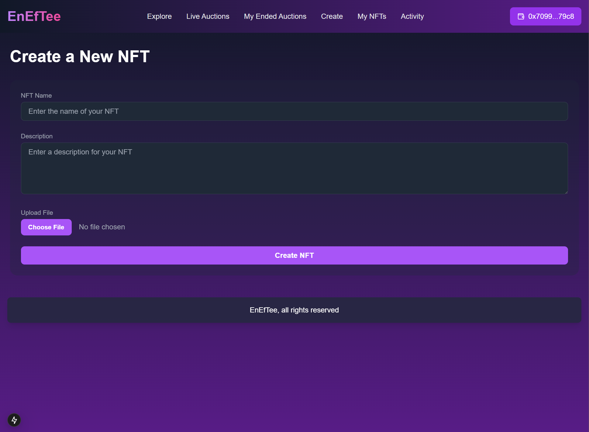

# NFT Auction Marketplace

Welcome to the **NFT Auction Marketplace**, a decentralized platform for minting, listing, and bidding on NFTs (Non-Fungible Tokens) securely and transparently.

---

## Features

- **Mint NFTs**: Create unique digital assets directly on the blockchain.
- **Auction NFTs**: List NFTs for bidding with customizable durations.
- **Real-time Updates**: Live updates on bidding and auction status.
- **Secure Transactions**: Powered by Ethereum smart contracts.

---

---

## Preview

Below are some screenshots of the platform:

### Home Page


### Auction Page


### Minting Page


---

## Tech Stack

### Frontend
- **Next.js**: React framework for server-side rendering and static site generation.
- **TailwindCSS**: For styling and responsive designs.

### Backend
- **Hardhat**: Ethereum development environment for deploying and testing smart contracts.
- **Ethers.js**: Library for blockchain interaction.

### Other Dependencies
- **dotenv**: Environment variable management.
- **React**: User interface library.

---

## Getting Started

### Prerequisites
Make sure you have the following installed:
- Node.js (v16 or higher)
- npm or yarn
- MetaMask (for wallet integration)
- A local Ethereum node or a test network (e.g., Hardhat)

---

### Installation

1. Clone the repository:
   ```bash
   git clone https://github.com/MatthewAlgo/EnEfTee.git
   cd EnEfTee
   ```

2. Install dependencies:
   ```bash
   npm install
   ```

3. Create a `.env.local` file and configure your environment variables:
   ```plaintext
   NEXT_PUBLIC_ETHERSCAN_API_KEY=<your_infura_project_key>
   SEED_PHRASE=<your_wallet_private_key>
   ```

---

### Running the Application

#### 1. Start the Local Ethereum Network
Use Hardhat to start a local Ethereum node:
   ```bash
   npx hardhat node
   ```

#### 2. Deploy Smart Contracts
Deploy the smart contracts to the local network:
   ```bash
   npx hardhat run scripts/deploy.ts --network localhost
   ```

#### 3. Start the Development Server
Start the Next.js development server:
   ```bash
   npm run dev
   ```

Visit [http://localhost:3000](http://localhost:3000) to explore the platform.

---

## Scripts

### Available Commands
- `npm run dev`: Start the development server.
- `npm run build`: Build the project for production.
- `npm run start`: Start the production server.
- `npm run test`: Run unit tests.
- `npm run deploy`: Deploy smart contracts.

---

## Project Structure

```plaintext
.
├── public/             # Static assets
├── src/                # Source code
│   ├── components/     # React components
│   ├── pages/          # Next.js pages
│   ├── styles/         # CSS styles and Tailwind configuration
│   ├── utils/          # Helper utilities
│   └── test/           # Unit tests
├── contracts/          # Solidity smart contracts
├── scripts/            # Deployment and utility scripts
├── hardhat.config.js   # Hardhat configuration
├── package.json        # Project metadata and dependencies
├── .env.local          # Environment variables
├── README.md           # Documentation
└── ...                 # Other files and configs
```

---

## Accounts

When running the Hardhat node, these accounts are generated for testing purposes. **Do not send real funds to these accounts.**

Example:
```plaintext
Account #0: 0x3f9d... (1000 ETH)
Private Key: 0xac...7bb
```

---